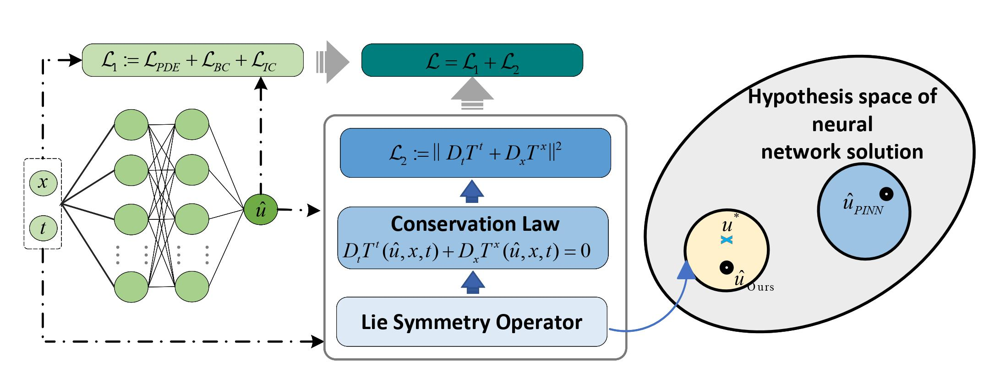

## This repository contains the code for the paper:
# " LSN: Preserving Conservation Laws in Modelling Financial Market Dynamics via  Differential Equations"


<!--  -->
<!--  -->

<!--  -->


[](LICENSE)


<!--[](https://arxiv.org/abs/2406.09189)-->


This paper introduce LSN, a symmetry-aware approach that addresses a fundamental challenge in AI-driven SDE solvers: ensuring AI models can learn and preserve intrinsic symmetries from data. By incorporating Lie symmetry principles, **LSN achieves a significant reduction in test error—over an order of magnitude—compared to state-of-the-art AI-driven methods**. The framework is not limited to specific equations or methods but provides a universal solution that can be applied across various AI-driven differential equation solvers.

[](https://git.io/typing-svg)


## Installation

```
Step 1: install pytorch

 conda install pytorch==1.13.1 torchvision==0.14.1 torchaudio==0.13.1 pytorch-cuda=11.7 -c pytorch -c nvidia
 
Step 2: install pyDOE 
   
 pip install pyDOE

```
## Schematic Diagram of Lie Symmetry Network



## Usage

<!--For task start run this command from repository root directory:-->

```
python LSN.py 
```

<!--## Citation

Please consider citing our paper if you find this repo useful in your work.

```
@article{jiang2024lie,
  title={Lie Symmetry Net: Preserving Conservation Laws in Modelling Financial Market Dynamics via Differential Equations},
  author={Jiang, Xuelian and Zhu, Tongtian and Wang, Can and Xu, Yingxiang and He, Fengxiang},
  journal={arXiv preprint arXiv:2406.09189},
  year={2024}
}
```-->

